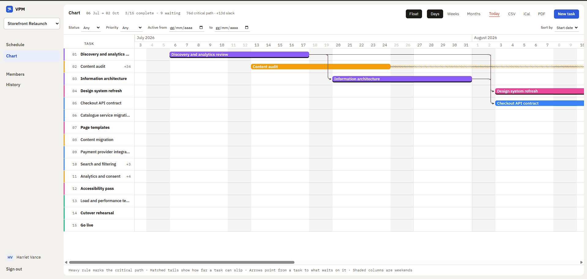
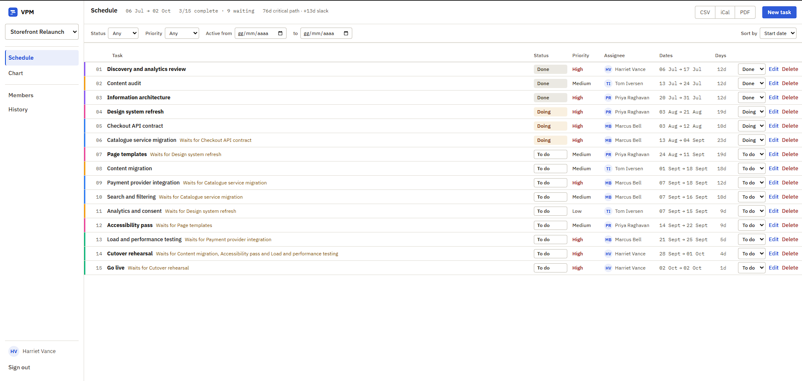
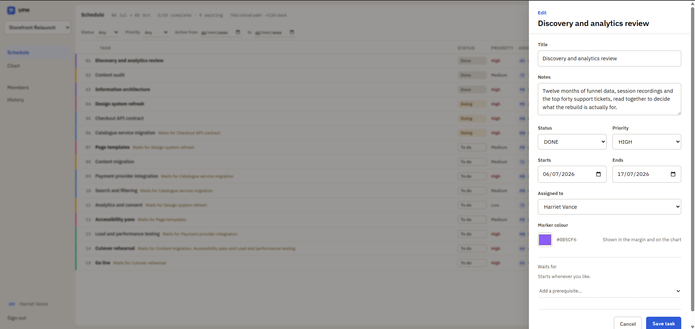
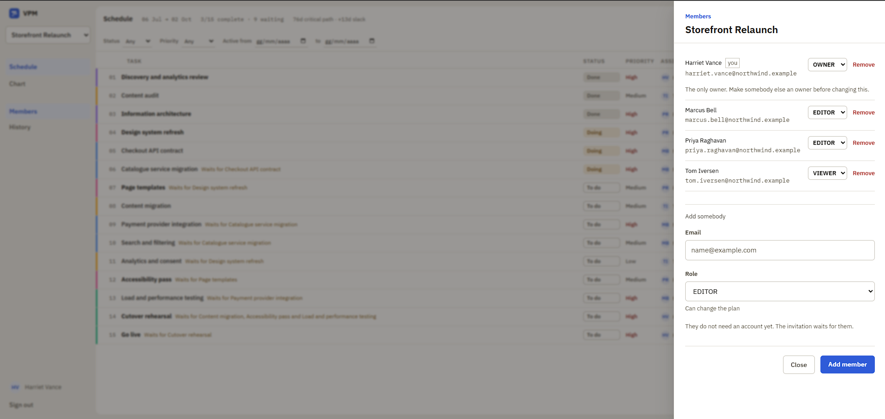
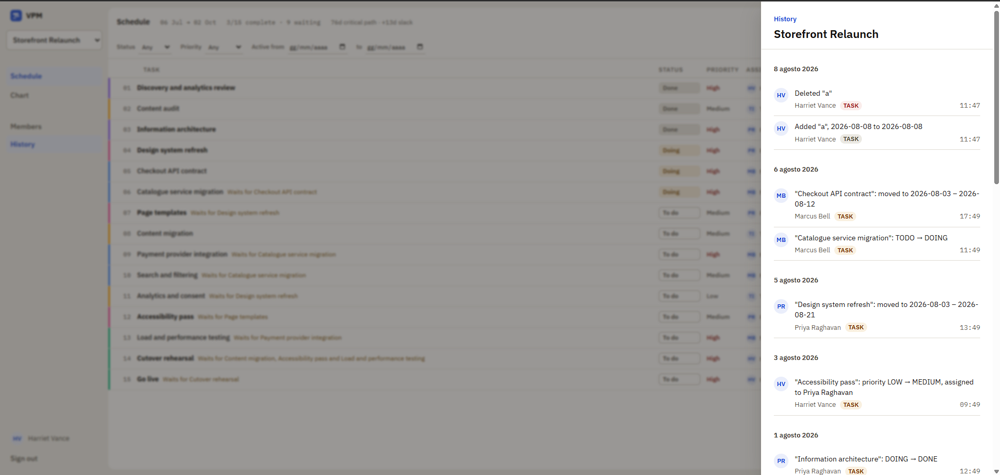
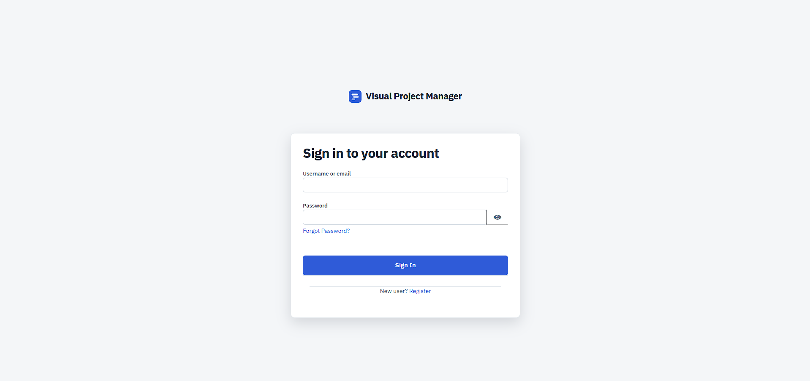
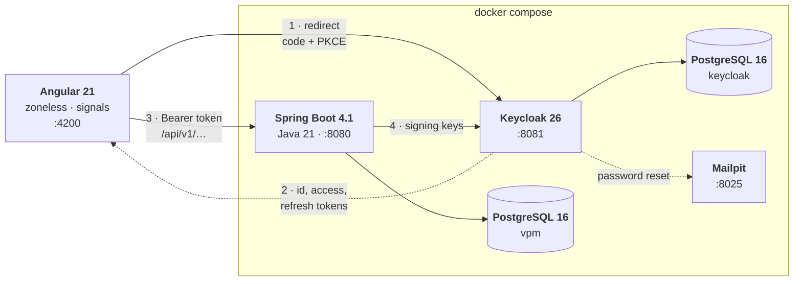

# Visual Project Manager

A planning tool for work that has an order to it. Tasks carry dates,
people and dependencies; the chart draws them; and the part worth building
is the one a list of tasks cannot show you: which of these tasks, if it
slips by a day, moves the finish date by a day.

Angular 21 in front, Spring Boot 4.1 behind, Keycloak for identity,
PostgreSQL underneath, and one `docker compose up` to run all of it.

**[Try it](https://vpm-demo.duckdns.org)**, signed in as `harriet` with the
password `demo`. That account owns the plan below and can change all of it;
`tom`, same password, sees the same plan read only. Everything is put back
every six hours, so nothing you do to it lasts, and nothing anybody else did
is waiting for you.



---

## Contents

- [What it does](#what-it-does)
- [Running it](#running-it)
- [Architecture](#architecture)
- [Where this came from](#where-this-came-from)
- [Decisions worth explaining](#decisions-worth-explaining)
- [The API](#the-api)
- [Tests](#tests)
- [Repository layout](#repository-layout)
- [Security](#security)
- [What it does not do](#what-it-does-not-do)
- [Licence](#licence)

---

## What it does

### The schedule

Every task with its dates, status, priority, assignee and prerequisites.
Filter by status, by priority or to a window of dates; sort by start, end,
title, priority or status.

Both happen in the browser over the whole plan rather than over what is on
screen. The list is already in memory and already the source both views
read from, so asking the server would add a round trip, a loading state
and a second definition of what "matching" means.

The date window selects tasks that **overlap** it rather than tasks
contained by it. A task running from before the window to after it is the
most relevant thing in that period, and containment is the one test that
would exclude it.



### The chart

The same plan, drawn. Bars can be dragged to move a task and grabbed at
either end to resize it, optimistically: the bar follows the pointer and
rolls back if the server refuses. Arrows connect each task to what it
waits for. Days, weeks and months are the three scales. The hatched tail
on a bar is how far that task can slip before it moves something else, and
the tasks with no tail are the critical path.

The table beside it can be widened or narrowed with the divider and sheds
columns as it shrinks. Dates go first, because the bar next to them is
drawn from exactly those two numbers.

### Editing a task

Dates, status, priority, colour, assignee and dependencies in one panel.
Dependencies are checked as they are added: a task cannot depend on
itself, cannot close a cycle, and cannot be marked done while something it
waits on is unfinished. Each refusal names the task responsible rather
than saying no.



### People and roles

Owners, editors and viewers, per project rather than globally, so the same
person can own one plan and only read another. Invitations go by email and
work for people who have never signed in: a placeholder is created and
claimed the first time they arrive with that address verified.



### History

Who changed what, and when. Written by the code making each change rather
than by a listener or an aspect, which is why it can say a task *moved
from the 3rd to the 21st* instead of that a task was updated.



### Taking it away

Three formats, all writing the rows on screen in the order shown, because
that is what somebody means by "export".

**CSV** carries the dates as ISO, the duration inclusive, the predecessors
named, and the two columns only this application can fill: whether a task
is on the critical path and how many days it can slip.

**iCal** turns each task into an all-day event, so the plan sits in a
calendar beside everything else that week. Free rather than busy, because
three weeks of work in progress is not three weeks of being unavailable.

**PDF** goes through the browser's print dialog. There is no PDF library
here and [there is not going to be one](#exports-are-mostly-small-print).

### Signing in

Keycloak, with a login theme that matches the application rather than
announcing that a different product is handling the password. On a local
install, registration and password reset are both live, and reset messages
land in Mailpit, a fake mail server in the compose file, so the whole flow
can be followed on a laptop with no mail account anywhere.

The public demo has both switched off. Its four accounts are the way in,
and a reset message sent from it would have nowhere to arrive.



---

## Running it

Docker and about four gigabytes of RAM. Nothing else: Java, Node and Maven
are only needed to develop.

```bash
git clone https://github.com/ghiacciolodev/Visual-Project-Manager.git
cd Visual-Project-Manager
cp .env.example .env          # on Windows: copy .env.example .env
docker compose up -d
```

First start takes a couple of minutes: Keycloak imports its realm, Flyway
creates the schema, and both images are built. Then:

| | |
|---|---|
| Application | http://localhost:4200 |
| API | http://localhost:8080/api/v1 |
| Keycloak | http://localhost:8081 |
| Mailpit (the fake inbox) | http://localhost:8025 |

Register from the sign-in screen. The realm requires the address to be
verified, so Keycloak sends a message and waits: open Mailpit, click the
link, and sign in to an empty schedule. The verification is not ceremony,
and [SECURITY.md](SECURITY.md) says what it prevents.

### Or start from the demo project

The screenshots above are a real plan in a real database:

```bash
pwsh scripts/demo/seed.ps1
```

Four accounts in Keycloak and a thirteen-week storefront relaunch in the
application database, linked to each other. Password `demo`:

| | | |
|---|---|---|
| `harriet` | Harriet Vance | owner |
| `marcus` | Marcus Bell | editor |
| `priya` | Priya Raghavan | editor |
| `tom` | Tom Iversen | viewer |

They all see the same plan. What differs is what the interface lets them
do with it: sign in as Tom for the read-only view, as Harriet for the
members panel the editors are not offered.

Run it twice and the second run replaces the first. It clears every project
the four `@northwind.example` accounts belong to, not only the one it wrote,
and any project left with no members at all. On a database of your own,
anything those four are not a member of is untouched.

Clearing more than it wrote is the point on the public instance, where the
same script runs every six hours. A visitor signed in as Harriet can make
projects of their own, and can type any address into the members panel, which
writes a row for a person who has not asked to be here. How often this runs is
how long that row exists. [SECURITY.md](SECURITY.md) sets out what a password
printed in a README does and does not put at risk, and
[the privacy page](https://vpm-demo.duckdns.org/privacy/) says the same thing
to the people it concerns.

### Developing

The two applications run better outside the containers, against the
infrastructure inside them:

```bash
docker compose up -d db keycloak keycloak-db mailpit
cd backend && ./mvnw spring-boot:run
cd frontend && npm install && npm start
```

Port 4200 is not a preference: it is the only redirect URI the Keycloak
client accepts and the only origin the backend allows through CORS.
`frontend/public/config.json` holds the addresses the browser calls, and
its committed values are the ones above. In a container the entrypoint
overwrites it, so [one image runs
anywhere](#one-image-three-addresses-one-file).

## Architecture



**Two databases, not one.** An identity provider's schema is its own
business: sharing one means a Flyway migration and a Keycloak upgrade can
collide over the same tables.

**Keycloak is addressed by two URLs, deliberately.** The browser reaches it
at `localhost:8081`, so that is the issuer written into every token. The
backend cannot resolve that address from inside the compose network, where
`localhost` is its own loopback, and fetches signing keys at
`keycloak:8080`. So the keys come over the internal address while the
issuer claim is checked against the public one. Using the internal address
for both would reject every real token; skipping the issuer check would
accept tokens minted by any realm on that server.

**Identity is federated; authorisation is local.** Keycloak knows who you
are and has no idea which projects you belong to. Roles are rows in this
application's database, checked per request. [SECURITY.md](SECURITY.md)
explains why they are not in the token.

### Inside the backend

Packages are by feature, not by layer: `task/`, `project/`, `schedule/`,
`audit/`, `user/`, each with its controller, service, entity and DTOs
together. Opening `task/` shows everything tasks do.

```
Controller ──▶ Service ──▶ Repository ──▶ PostgreSQL
                  │
             @PreAuthorize("@access.canEdit(#projectId)")
```

Authorisation sits on the **service**, one layer closer to the data than
the controller, so it still applies if a second controller, a scheduled
job or a test calls in.

Flyway owns the schema and Hibernate is set to `validate`. With `update`,
Hibernate silently alters the database and the migrations stop being the
truth.

### Inside the frontend

Standalone components, `OnPush`, zoneless change detection, signals rather
than observables in the view layer. Services hold state as signals;
components read and compute.

The chart and the three panels are `@defer`red, so a production build's
initial bundle is 414 kB raw and 104 kB over the wire, with the chart
arriving after it as a further 15 kB.

Logic that can live outside a component does. `core/schedule.ts` holds the
geometry, `core/task-filter.ts` the filtering and sorting, `core/export.ts`
the two file formats, all as pure functions. A function is tested by
calling it; an event handler is tested by mounting a component and
pretending to be a mouse.

---

## Where this came from

This began as a brief I set for a class, back when I was teaching. The
brief is [in this repository](docs/assignment.pdf), in Italian, so none of
what follows has to be taken on trust.

The product is the same: tasks with a title, a status, two dates and a
colour; a dashboard of cards; a Gantt chart drawn from the same data; and
dependencies arriving at the end. The stack it prescribed was not this one.

| The brief | Here |
|---|---|
| Python Flask | Spring Boot 4.1 on Java 21 |
| MySQL, hosted on Aiven | PostgreSQL 16, with Flyway owning the schema |
| **No ORM.** A `DatabaseWrapper` over `pymysql`, every query by hand | JPA and Hibernate, with hand-written SQL kept for one thing |
| Angular | Angular |
| Eight commits, messages prescribed, graded by walking the history | However many it took |

The one constraint the brief puts in bold is the no-ORM rule: write the
`CREATE TABLE` and the `JOIN` by hand, so that Hibernate stops being magic
afterwards.

This repository answers the same brief on a different stack, and the
interesting part is where the two disagree.

**The ORM rule, inverted rather than dropped.** JPA does the CRUD, and
hand-written SQL survives in exactly one place: `DependencyGraphRepository`,
where a recursive CTE answers "can this task already reach that one?" in a
single round trip. An ORM cannot express that query, and the alternative is
loading every edge into memory to do in Java what the database does better.
Both rules point at the same thing from opposite sides: know what the ORM
is doing for you, and know what it will not do at all.

**PostgreSQL, and what actually depends on it.** Less than it looks.
MySQL 8 runs `WITH RECURSIVE` and has enforced `CHECK` constraints since
8.0.16, so the reachability query and the constraints mirroring each enum
would both work there. Two things would not move: the partial index
covering only the rows that are not soft-deleted, which MySQL has no
equivalent for, and `TIMESTAMPTZ`, whose semantics MySQL's two timestamp
types each get half of.

**Spring Boot, for what came after the brief.** Everything the assignment
asks for would be comfortable in Flask. The work that is here and not
there is per-project authorisation on every service method, declarative
transactions, and an optimistic-concurrency check. Flask can do all three
with extensions; `@PreAuthorize` and `@Transactional` made them a line
each.

**The eight commits are a good device, and this history does not follow
them.** Grading by walking the commit log makes the process visible
instead of only the result, and a student who cannot work in increments
finds that out early. This history is longer, messier, and includes
commits that undo earlier ones, which is what the work looks like when
nobody has written the steps down in advance.

The brief stops at dependencies, and that turns out to be where the
interesting problem starts. It asks for a warning when a task is blocked,
which is a fact about a single edge and can be read off one row. It does
not ask what the edges *cost*, and that question needs the whole graph: of
the fifteen tasks in the demo plan, seven decide the finish date and the
other eight have slack.

The demo plan makes that argument better than it was designed to. Read it
by eye and the backend chain looks like the one that decides the date: the
checkout contract, the catalogue migration, the payments, the load test.
Every one of those carries nine days of float. What actually sets the
finish date is the design and interface chain, through the design system,
the page templates and the accessibility pass. The obvious reading and the
arithmetic disagree, and that is the whole reason for computing it.

---

## Decisions worth explaining

### The critical path is the point of the whole thing

`CriticalPathService` runs the Critical Path Method: two passes over the
dependency graph in topological order (Kahn's algorithm), forward for the
earliest each task can start and backward for the latest it can start
without moving the finish date. The difference is that task's total float,
and the tasks with none of it are the critical path.

Arithmetic on in-memory maps rather than queries, because the graph is
small enough that fetching it once and walking it in Java beats asking the
database per step. That is the opposite of the trade-off made for cycle
detection, where a recursive CTE answers "is this reachable from that?" in
one round trip and Java would need the whole graph to answer the same
question.

The model is a small one and worth stating rather than leaving to be
discovered. Finish-to-start only: no start-to-start, no lag, no lead.
Calendar days rather than working days, so a fortnight is fourteen days
and the shaded weekends are counted. The network is anchored at day zero,
so the dates somebody typed do not constrain the forward pass, and
"critical" means critical in an ideal as-soon-as-possible replan rather
than in the plan as drawn. The chart compensates rather than hiding it:
`slipOf` measures how far a bar can move from where it is actually drawn,
and when that disagrees with total float the tooltip gives both.

### Two people editing one task

Send back the version the form was built from, and the write is refused if
the task has moved on. The check is required, so there is no unconditional
write and no way to get last-write-wins by omission.

This was a timestamp first, and the timestamp could not be reported
honestly. Hibernate writes `@UpdateTimestamp` during a flush, and the
response was assembled before one was guaranteed: `findPredecessors` goes
through `JdbcTemplate`, which triggers no flush, and the audit insert
writes only its own row. So a `PUT` answered with the value the row held
*before* its own write, and a client that saved it and sent it on the next
edit was told somebody else had got there first. One person, one task, two
edits.

It was found by writing the round trip out as a test rather than by
reading the code, which had been read twice. The first explanation was
wrong too: the membership lookup inside `assignableOrThrow` does force a
flush, so it looked as though assigned tasks escaped. They did not,
because `apply()` sets the assignee *after* that lookup and dirties the
row again. Both cases were stale.

`@Version` has no such ordering problem. Hibernate maintains the number
and puts it in the `UPDATE`'s `WHERE` clause, so a stale write fails at
the database whether or not the service remembers to check. The service
checks anyway, because a checked refusal can say something a person can
act on and an optimistic-lock exception cannot.

### Other people's changes arrive on their own

The task list is re-fetched every twenty seconds while a view is open, so
somebody else's new task appears without a reload. Polling, not WebSockets
or SSE, for an honest reason: a change lands every few minutes at most, a
twenty-second delay is invisible at that tempo, and a push channel means a
connection to hold open, a reconnection policy and per-project fan-out for
a payload that is a few kilobytes of JSON. The polling is
reference-counted, pauses while the tab is hidden and while a bar is being
dragged, and would be the first thing to replace if this ever became
collaborative in the live-cursor sense.

### One component behind two routes

The schedule and the chart were separate components drawing the same dates
two different ways. They share one component now; what the two routes
carry is whether the timeline is drawn beside the table.

For a while both drew it, on the argument that one screen answering
questions about dates and people at once beats two answering half each. On
a wide monitor that held. On a laptop the table's own columns left the
timeline about ten days wide, and a sliver of chart reads as a mistake
rather than a choice. So the schedule is a table and the chart is a chart,
and the code they have in common is still in one place.

### Paging the default caller never sees

`GET /tasks` returns everything unless asked otherwise. `?page=&size=`
switches to pages, reported in `X-Total-Count` / `X-Page` / `X-Page-Size`
headers rather than by wrapping the body, so the response shape never
changes and a caller that does not ask for pages cannot be broken by their
arrival. This application is such a caller, deliberately: the chart
measures its window across the whole plan and the filters are computed
over the same list, so one page would draw the wrong scale and silently
narrow the filters to a fiftieth of the data.

The paging is done by the query. It was not at first: the endpoint read
every task and called `subList`, which made `X-Total-Count` accurate and
the cost of producing it a fiction, since a caller asking for ten rows out
of two thousand was served two thousand. Paging that does not reduce the
work is a header rather than a feature.

### Exports are mostly small print

jsPDF and pdfmake both work, and both were the wrong answer. Neither can
draw this chart: it is HTML and SVG laid out by a browser, and putting it
in a PDF means re-implementing bars, connectors, float tails and the day
grid in a second set of primitives. That is the duplication merging the
two views had just removed, with a dependency attached. The browser
already has a renderer that agrees with the one on screen, so the button
calls `window.print()` and the work is a print stylesheet. Measured:
everything shipped to write CSV and iCal is **1.4 kB gzipped**, and it
rides in the chart's lazy chunk.

The stylesheet strips the navigation and every control, turns off the
scrollport so the chart lays out in full instead of printing as four
horizontal slices, unpins the sticky header and frozen column that were
holding still against a scroll that no longer exists, and turns
`print-color-adjust` back on, without which every bar prints as a white
rectangle with white text on it. Two things happen in TypeScript because
CSS cannot know them: a `beforeprint` listener refits the day column so
the whole span crosses one page, narrowing only, with a synchronous
`ApplicationRef.tick()` because zoneless change detection is scheduled and
the browser snapshots the layout the moment the handler returns; and the
sheet prints a line naming the active filters, because a page showing six
tasks of fifteen with nothing to say the other nine were filtered out is
not a shorter document, it is a wrong one.

The file formats are detail that only shows up as a bug days later. A CSV
cell beginning with `=`, `+`, `-` or `@` is a formula to every spreadsheet,
so a task title is executable content the moment somebody opens the file;
each is prefixed with an apostrophe, and RFC 4180 quoting is applied
separately because a spreadsheet strips the quoting before deciding what
the cell means. A byte-order mark goes in front so Excel on Windows reads
UTF-8 rather than the system code page. In iCal, `DTEND` on an all-day
event is **exclusive**, so a task drawn through the 17th ends on the 18th;
writing the end date there is the classic bug that makes every task a day
short. Content lines fold at 75 **octets** and not 75 characters, so the
folding measures encoded length as it goes rather than slicing at an index
and cutting a multi-byte character in half.

### One image, three addresses, one file

The API's address, Keycloak's, and the `connect-src` of the content
security policy are the three things a build cannot know. All three were
compiled in and all three said localhost, so the Docker image was correct
on the machine that produced it and useless anywhere else.

They come from `config.json` now, fetched from the application's own
origin before anything else runs. The container writes it from environment
variables in a script under `/docker-entrypoint.d`, which nginx's own
entrypoint runs before starting the server, so it cannot be forgotten. The
same two values produce `connect-src`, because a policy and an application
that disagree about where the API is fail with every request blocked,
nothing in the server log, and the explanation only in the browser
console.

A fourth value joined them later and is not an address: whether this
instance is the public demo. It turns on the standing notice that the
accounts are shared and the data does not survive the day, which is true
of one deployment and false of every other copy of this application, so it
belongs in the same file for the same reason the addresses do.

Two details make it work rather than merely exist. The OIDC settings go
through a `StsConfigHttpLoader`, so the library waits for the fetch itself
rather than needing values at provider-construction time. And
`runtimeConfig()` falls back to the development defaults instead of
throwing, which is what lets a hundred and twenty-six unit tests keep
asserting against real URLs without a network call any of them would have
had to mock.

The failure this arrangement can still produce is worth writing down,
because it happened here. Reading the configuration in a field initialiser
captures whatever was in force when that class was constructed, and one
service was constructed inside the app initializer itself, before the
fetch resolved. It then held the development default for the life of the
page: a deployed browser calling `localhost`, the content security policy
correctly refusing the connection, and a project list that came back empty
with nothing in any server log, because the request never left the
browser. Every service reads the address inside a method now.

The policy itself took work for a different reason. A strict
`script-src 'self'` is the defence in depth for tokens in
`sessionStorage`, and Angular's critical-CSS inliner shipped the
stylesheet as `<link media="print" onload="this.media='all'">` with the
plain link only inside `<noscript>`, making an inline event handler the
only path by which a scripted browser received any CSS. Turning
`optimization.styles.inlineCritical` off is what makes the directive
possible. And `add_header` inside an nginx `location` **replaces** the
inherited set rather than extending it, so the one `add_header
Cache-Control` on hashed assets would have stripped every security header
from exactly the files that most need `nosniff`.

Verified by running the built image with a different environment and
watching `config.json`, the policy and the OIDC client id all follow.

### Tasks are soft-deleted, and their edges are not

`deleted_at` is set and the row stays, but `unlinkAll` removes every
dependency edge for real. Both halves are deliberate and they do not add
up to a restore. The edges have to go, because a soft-deleted row still
exists so `ON DELETE CASCADE` never fires for it, and an edge left behind
goes on blocking a successor on behalf of a task nobody can see or finish.
What the surviving row is for is reference rather than recovery: the audit
log names tasks, and a foreign key elsewhere still resolves.
[SECURITY.md](SECURITY.md) lists the retention question this leaves open.

---

## The API

`/api/v1`, JSON, Bearer tokens. Errors are RFC 9457 Problem Details.

| Method | Path | |
|---|---|---|
| `GET` | `/projects` | the caller's projects |
| `POST` | `/projects` | create, as owner |
| `GET` `PUT` `DELETE` | `/projects/{id}` | read, rename, delete |
| `GET` | `/projects/{id}/members` | |
| `POST` | `/projects/{id}/members` | invite by email |
| `PATCH` | `/projects/{id}/members/{userId}` | change role |
| `DELETE` | `/projects/{id}/members/{userId}` | remove, or leave |
| `GET` | `/projects/{id}/tasks` | all, or `?page=&size=` |
| `POST` | `/projects/{id}/tasks` | 201 with `Location` |
| `GET` `PUT` `DELETE` | `/projects/{id}/tasks/{taskId}` | |
| `POST` | `/projects/{id}/tasks/{taskId}/dependencies` | |
| `DELETE` | `/projects/{id}/tasks/{taskId}/dependencies/{predecessorId}` | |
| `GET` | `/projects/{id}/schedule/critical-path` | float per task, and the path |
| `GET` | `/projects/{id}/audit` | history, newest first |
| `GET` | `/me` | the caller, provisioned on first sight |

An update must carry `expectedVersion`, and is refused with `409` without
it. Writes are rate limited to 120 a minute per caller and answer `429`
with `Retry-After`; reads are not limited, and
[SECURITY.md](SECURITY.md#csrf-cors-rate-limiting) explains the asymmetry.

There are ceilings as well as a rate, because the two answer different
questions. 120 writes a minute limits how fast; on its own the answer to
how much was "for ever", and one account at that rate adds around a
hundred and seventy thousand rows a day with registration open. A project
holds at most 2000 tasks and 100 members, and one person is in at most 100
projects. All three are configuration, set far above anything honest.

Exports are not endpoints. They are written in the browser from data the
caller already has, which is why they can follow the filter on screen.

---

## Tests

```bash
cd backend  && ./mvnw verify      # 62 tests
cd frontend && npm test           # 126 tests, 10 files
cd frontend && npm run test:e2e   # 3, against a stack that is already up
```

**Backend.** Unit tests for the parts with logic worth testing alone, and
integration tests that run the whole stack against a real PostgreSQL
started by Testcontainers: one database per run, torn down with it, no
second place where the version has to be kept in step. They are bound to
`verify` through Failsafe, and they are the ones that prove authorisation
actually refuses, which a mocked repository cannot.

**Frontend.** Vitest through Angular's own test builder. The pure
functions are tested by calling them; the services against
`HttpTestingController`; polling against fake timers; and the component by
constructing it and asking what it computed rather than by rendering it
and reading the DOM back.

Several exist because something was wrong, and they are the useful ones.
`select-binding.spec.ts` pins why a member added as `EDITOR` displayed as
`OWNER`: `[value]` on a `<select>` is assigned before `@for` has created
any options. `ConcurrentEditIT` pins that a `PUT` answers with the version
it just wrote, in both the assigned and unassigned cases, because the
first diagnosis said only one of them was broken. `PlaceholderClaimIT`
pins that an unverified address cannot inherit an invitation.
`export.spec.ts` checks that a task titled `=HYPERLINK(...)` cannot
execute in a spreadsheet, that `DTEND` lands the day after the task, and
that forty emoji fold without a character being cut in half.

**End to end.** One person signs in and sees the plan, which is the one
thing neither of the above can prove. Both can pass while the screen is
empty, because what joins them is a browser fetching `config.json`,
signing in through Keycloak, and calling an address it was told at
start-up. Every defect this project has had in production lived in that
seam: a redirect URI the realm did not accept, a service holding the
development API address because it was constructed before the fetch
resolved, a content security policy correctly refusing the request that
address produced. None of them broke a test, and none of them reached a
server log, because the request never left the browser.

Playwright, three tests, and a listener on the console and the network
that fails the run on anything the browser refused. That listener is the
point: a blocked request leaves the screen merely empty, and an empty
screen is what an application with no data legitimately looks like.

It expects a stack that is already up and seeded, because a test that
starts one would be a third place that knows the order to start things
in. CI runs everything on every push and every pull request: the two
suites above, then the images, then the stack, then the browser.

---

## Repository layout

```
backend/          Spring Boot 4.1, Java 21
  src/main/java/it/ghiacciolodev/vpm/
    task/         tasks, dependencies, the graph
    project/      projects, membership, the authorisation rules
    schedule/     critical path
    audit/        history
    user/         local accounts, provisioned from the token
    security/     JWT decoding, role conversion, filter chain
    common/       Problem Details, validation, rate limiting, ceilings
  src/main/resources/db/migration/    Flyway
  src/test/                           unit + Testcontainers

frontend/         Angular 21, standalone, zoneless
  src/app/
    core/         services, pure geometry, filters, exports, runtime config
    features/     gantt · tasks · members · projects · history
    models/
  public/config.json               the development defaults
  public/fonts/                    IBM Plex, served from here and not from Google
  public/privacy/                  the notice, static so it needs no session
  nginx.conf                       how the built app is served
  security-headers.conf.template   CSP, with connect-src substituted at start
  docker-entrypoint.d/             writes config.json and fills the template

keycloak/
  realm-export.json     the whole identity setup, version controlled
  themes/vpm/           the login theme, and the same two font files

scripts/demo/     the plan in the screenshots, and what puts it back
scripts/deploy/   the systemd timer that runs that on a schedule

docs/             screenshots, and the brief this began as

docker-compose.yml        the development stack
docker-compose.prod.yml   what changes when it is reachable from the internet
Caddyfile                 TLS, and which paths Keycloak is allowed to answer
```

---

## Security

Identity, authorisation, input handling, and at more length the things
that are wrong with all three: **[SECURITY.md](SECURITY.md)**.

The short version: Authorization Code with PKCE and no client secret;
authorisation enforced on the service layer per project; `404` rather than
`403` for non-members so ids cannot be enumerated; every task lookup keyed
by id *and* project; an invitation claimable only on a verified address;
validation in the DTO and as CHECK constraints in the schema; refresh
tokens that rotate and revoke on reuse; and a content security policy with
a strict `script-src`.

And the one no header closes: tokens live in `sessionStorage`, so script
running on this origin can read them. An `httpOnly` cookie would not
change that outcome, since script on the origin can use a cookie without
reading it; what it would change is whether the token can be copied
elsewhere.

---

## What it does not do

There is no live collaboration: no cursors, no presence, no operational
transform. Two people editing the same task get a conflict, not a merge.

Export stops at CSV, iCal and print-to-PDF. There is no Microsoft Project
file and there is not going to be one: `.mpp` is a compound binary format,
and the interchange formats around it describe calendars, resource costs
and work contours this application has no concept of. It would be a large
piece of work producing a file that mostly says "unknown".

There is no capacity model. A person can be assigned three tasks that
overlap completely and nothing objects, because the schedule knows dates
and dependencies and nothing about how long anybody's day is.

There is no baseline. You cannot compare the plan to what it looked like
last month; the history says what changed, but the chart only ever draws
now.

Rows are not virtualised. The plan renders every task, which is fine into
the hundreds and would need `cdk-virtual-scroll` beyond that. Measured
before deciding rather than assumed: from fifty rows to a thousand, the
cost of editing one of them stays flat at about 4 ms, because signals
update the row that changed and not the list.

---

## Licence

[MIT](LICENSE). Take it, read it, use it, ship it.

Nothing in the dependency tree argues otherwise, which was checked rather
than assumed: every published `pom` was read rather than recalled.
Hibernate is the one worth naming, because a lot of people still remember
it as LGPL and `hibernate-core` 7.4.1 declares Apache 2.0. So do Flyway,
Nimbus and `bucket4j-core` 8.10.1; the PostgreSQL driver is BSD-2-Clause
and Lombok is MIT. On the frontend, all 471 packages in the tree resolve
to MIT, ISC, Apache 2.0, BSD, BlueOak, CC0 or 0BSD, with no copyleft at
any depth.

IBM Plex is under the SIL Open Font Licence and is fetched from Google
Fonts at runtime rather than redistributed here, so it carries its own
terms and none of this repository's.
