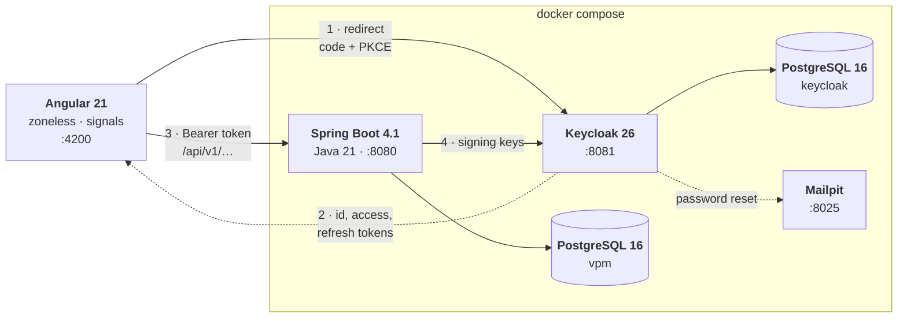

# Visual Project Manager

A planning tool for work that has an order to it. Tasks carry dates,
people and dependencies; the chart draws them; and the part worth building
is the one a list of tasks cannot show you: which of these tasks, if it
slips by a day, moves the finish date by a day.

Angular 21 in front, Spring Boot 4.1 behind, Keycloak for identity,
PostgreSQL underneath, and one `docker compose up` to run all of it.


---

## Contents

- [What it does](#what-it-does)
- [Running it](#running-it)
- [Architecture](#architecture)
- [Where this came from](#where-this-came-from)
- [Decisions worth explaining](#decisions-worth-explaining)
- [The API](#the-api)
- [Tests](#tests)
- [Repository layout](#repository-layout)
- [Security](#security)
- [What it does not do](#what-it-does-not-do)
- [Licence](#licence)

---

## What it does

### The schedule

Every task in the project, with its dates, its status, its priority, the
person doing it and what it is waiting on. Filter by status, by priority
or to a window of dates; sort by start, end, title, priority or status.

Both happen in the browser, over the whole plan rather than over what is
on screen. The list is already in memory and already the source both views
read from, so asking the server would add a round trip, a loading state
and a second definition of what "matching" means.

The date window selects tasks that **overlap** it rather than tasks
contained by it. A task running from before the window to after it is the
most relevant thing in that period, and a containment test is the one
thing that would exclude it.


### The chart

The same plan, drawn. Bars can be dragged to move a task and grabbed at
either end to resize it, optimistically: the bar follows the pointer and
rolls back if the server refuses. Arrows connect each task to what it
waits for. Tasks with zero float are marked, and those are the ones that
decide the launch date.

The table beside the chart can be widened or narrowed with the divider,
and sheds columns as it gets smaller. Dates go first, because the bar next
to them is drawn from exactly those two numbers.

The picture at the top of this page is that view, zoomed to single days.
Days, weeks and months are the three scales; the hatched tail on a bar is
how far that task can slip before it moves something else, and the tasks
with no tail at all are the critical path.

### Editing a task

Dates, status, priority, colour, assignee and dependencies in one panel.
Dependencies are checked as they are added: a task cannot depend on
itself, cannot close a cycle, and cannot be marked done while something it
waits on is unfinished. Each refusal names the task responsible rather
than saying no.


### People and roles

Owners, editors and viewers, per project rather than globally, so the same
person can own one plan and only read another. Invitations go by email and
work for people who have never signed in: a placeholder is created and
claimed the first time they do.


### History

Who changed what, and when. Written by the code making each change rather
than by a listener or an aspect, which is why it can say a task *moved
from the 3rd to the 21st* instead of that a task was updated.


### Taking it away

Three formats, all writing the rows on screen in the order they are shown,
because that is what somebody means by "export".

**CSV** carries the dates as ISO, the duration inclusive, the predecessors
named, and the two columns only this application can fill: whether a task
is on the critical path and how many days it can slip. Built in the
browser, because the filters are computed there too. An endpoint could
only ever export the whole project in the server's order, which is the
wrong answer to the question the button is asking.

**iCal** turns each task into an all-day event, so the plan can sit in a
calendar beside everything else happening that week. Free rather than
busy, because three weeks of work in progress is not three weeks of being
unavailable. The event ids are derived from the task ids, so importing a
second time updates the events already there instead of adding a duplicate
set.

**PDF** goes through the browser's print dialog, where "Save as PDF" is
the destination. There is no PDF library here and there is not going to be
one; [below](#a-pdf-without-a-pdf-library) explains why, and what the
print stylesheet does instead.

### Signing in

Keycloak, with a login theme that matches the application rather than
announcing that a different product is handling the password. Registration
and password reset are both live; reset messages land in Mailpit, a fake
mail server in the compose file, so the whole flow can be followed through
on a laptop with no mail account anywhere.


---

## Running it

You need Docker and about four gigabytes of RAM. Nothing else: Java, Node
and Maven are only needed to develop, not to run.

```bash
git clone https://github.com/ghiacciolodev/Visual-Project-Manager.git
cd Visual-Project-Manager
cp .env.example .env          # on Windows: copy .env.example .env
docker compose up -d
```

First start takes a couple of minutes: Keycloak imports its realm, Flyway
creates the schema, and both images are built. When it settles:

| | |
|---|---|
| Application | http://localhost:4200 |
| API | http://localhost:8080/api/v1 |
| Keycloak | http://localhost:8081 |
| Mailpit (the fake inbox) | http://localhost:8025 |

Register an account from the sign-in screen and you get an empty schedule
to fill.

### Or start from the demo project

The screenshots above are a real plan in a real database. To have it:

```bash
pwsh scripts/demo/seed.ps1
```

It creates four accounts in Keycloak and a thirteen-week storefront
relaunch in the application database, linked to each other. Sign in as any
of them, password `demo`:

| | | |
|---|---|---|
| `harriet` | Harriet Vance | owner |
| `marcus` | Marcus Bell | editor |
| `priya` | Priya Raghavan | editor |
| `tom` | Tom Iversen | viewer |

They all see the same plan. What differs is what the interface lets them
do with it. Sign in as Tom to see the read-only view, and as Harriet to
see the members panel that Marcus and Priya are not offered.

Run it twice and the second run replaces the first. It writes only its own
project and its own four `@northwind.example` accounts, so a database you
are already using keeps everything else. It is for local development only,
and [SECURITY.md](SECURITY.md) says why.

### Developing

The two applications run better outside the containers, against the
infrastructure inside them:

```bash
docker compose up -d db keycloak keycloak-db mailpit
```

```bash
cd backend && ./mvnw spring-boot:run
```

```bash
cd frontend && npm install && npm start
```

The frontend must be served on port 4200. That is the only redirect URI
the Keycloak client accepts, and the only origin the backend's CORS
configuration allows.

---

## Architecture



**Two databases, not one.** An identity provider's schema is its own
business: sharing one would mean a Flyway migration and a Keycloak upgrade
can collide over the same tables.

**Keycloak is addressed by two URLs and that is deliberate.** The browser
reaches it at `localhost:8081`, so that is the issuer written into every
token. The backend, inside the compose network, cannot resolve that
address, because `localhost` is its own loopback, and it fetches signing
keys at `keycloak:8080` instead. So the keys come over the internal
address while the issuer claim is checked against the public one. Using
the internal address for both would reject every real token; skipping the
issuer check would accept tokens minted by any realm on that server.

**Identity is federated; authorisation is local.** Keycloak knows who you
are and has no idea which projects you belong to. Roles are rows in this
application's database, checked per request. [SECURITY.md](SECURITY.md)
explains why they are not in the token.

### Inside the backend

Packages are by feature, not by layer: `task/`, `project/`, `schedule/`,
`audit/`, `user/`, each with its controller, service, entity and DTOs
together. Opening `task/` shows everything tasks do.

```
Controller ──▶ Service ──▶ Repository ──▶ PostgreSQL
                  │
             @PreAuthorize("@access.canEdit(#projectId)")
```

Authorisation sits on the **service**, one layer closer to the data than
the controller, so it still applies if a second controller, a scheduled
job or a test calls in.

Flyway owns the schema and Hibernate is set to `validate`. With `update`,
Hibernate silently alters the database and the migrations stop being the
truth.

### Inside the frontend

Standalone components, `OnPush`, zoneless change detection, signals rather
than observables in the view layer. Services hold state as signals;
components read them and compute.

The three panels (members, project, history) are `@defer`red, so most
people never download them, and so is the chart itself. A production
build's initial bundle is 414 kB raw, 105 kB over the wire; the chart
arrives after it as a further 15 kB.

Geometry is a set of pure functions in `core/schedule.ts`: where a bar
starts, how wide it is, where a connector's elbow goes, what dates a drag
of *n* pixels means. Deliberately separated from the components, because a
function can be tested by calling it and an event handler can only be
tested by mounting a component and pretending to be a mouse.

---

## Where this came from

This began as a brief I set for a class, back when I was teaching. The
brief is [in this repository](docs/assignment.pdf), in Italian, so none of
what follows has to be taken on trust.

The product is the same one: tasks carrying a title, a status, two dates
and a colour; a dashboard of cards; a Gantt chart drawn from the same
data; and dependencies between tasks arriving at the end.

The stack it prescribed was not this one.

| The brief | Here |
|---|---|
| Python Flask | Spring Boot 4.1 on Java 21 |
| MySQL, hosted on Aiven | PostgreSQL 16, with Flyway owning the schema |
| **No ORM.** A `DatabaseWrapper` over `pymysql`, every query written by hand | JPA and Hibernate, with hand-written SQL kept for one thing |
| Angular | Angular |
| Eight commits, messages prescribed, graded by walking the history | However many it took |

The one constraint the brief puts in bold is the no-ORM rule: write the
`CREATE TABLE` and the `JOIN` by hand, so that Hibernate stops being magic
afterwards.

This repository answers the same brief on a different stack, and the
interesting part is where the two disagree.

**The ORM rule, inverted rather than dropped.** JPA does the CRUD, and
hand-written SQL survives in exactly one place: `DependencyGraphRepository`,
where a recursive CTE answers "can this task already reach that one?" in a
single round trip. An ORM cannot express that query, and the alternative is
loading every edge into memory to do in Java what the database does better.
Both rules point at the same thing from opposite sides: know what the ORM
is doing for you, and know what it will not do at all.

**PostgreSQL, and what actually depends on it.** Less than it looks.
MySQL 8 runs `WITH RECURSIVE` and has enforced `CHECK` constraints since
8.0.16, so the reachability query and the constraints mirroring each enum
would both work there. Two things would not move: the partial index
covering only the rows that are not soft-deleted, which MySQL has no
equivalent for, and `TIMESTAMPTZ`, whose semantics MySQL's two timestamp
types each get half of.

**Spring Boot, for what came after the brief.** Everything the assignment
asks for would be comfortable in Flask. The work that is here and not
there is per-project authorisation on every service method, declarative
transactions, and an optimistic-concurrency check. Flask can do all three
with extensions; `@PreAuthorize` and `@Transactional` made them a line
each.

**The eight commits are a good device, and this history does not follow
them.** Grading by walking the commit log makes the process visible
instead of only the result, and a student who cannot work in increments
finds that out early. This history is longer, messier, and includes
commits that undo earlier ones, which is what the work looks like when
nobody has written the steps down in advance. The nearest thing to it here
is the audit log, which asks of a plan what a commit log asks of a
project.

The brief stops at dependencies, and that turns out to be where the
interesting problem starts. It asks for a warning when a task is blocked,
which is a fact about a single edge and can be read off one row. It does
not ask what the edges *cost*, and that question needs the whole graph:
of the fifteen tasks in the demo plan, seven decide the finish date and
the other eight have slack, and a day lost on any of the seven is a day
lost on the project.

The demo plan makes that argument better than it was designed to. Read it
by eye and the backend chain looks like the one that decides the date: it
is the run of work with the obvious hard edges, agreeing the checkout
contract, migrating the catalogue, integrating payments, load-testing the
result. Every one of those carries nine days of float. What actually sets
the finish date is the design and interface chain, through the design
system, the page templates and the accessibility pass. The obvious reading
of the plan and the arithmetic disagree, and that is the entire reason for
computing it rather than pointing at the chart and deciding.

That is the Critical Path Method, and it is the first thing in the section
below.

---

## Decisions worth explaining

### The critical path is the point of the whole thing

`CriticalPathService` runs the Critical Path Method: two passes over the
dependency graph in topological order (Kahn's algorithm), forward for the
earliest each task can start and backward for the latest it can start
without moving the finish date. The difference is that task's total float,
and the tasks with none of it are the critical path.

It is arithmetic on in-memory maps rather than queries, because the graph
is small enough that fetching it once and walking it in Java beats asking
the database per step. That is the opposite of the trade-off made for
cycle detection, where a recursive CTE answers "is this reachable from
that?" in one round trip and Java would need the whole graph to answer the
same question.

### Two people editing one task

Send back the `updatedAt` the form was built from, and the server refuses
the write if the task has moved on:

```java
if (!request.expectedUpdatedAt().equals(task.getUpdatedAt())) {
    throw new ConflictException("Somebody else changed this task while you were editing it…");
}
```

Compared by **equality**, not by "is older". A clock that steps backwards
or two instances a few milliseconds apart would make an ordering test
quietly accept a stale write. The question is not "is this newer" but "is
this the same task I read".

Not `If-Unmodified-Since`, which would be the obvious HTTP answer: that
header carries whole seconds, and two edits inside the same second are
exactly the case being defended against.

### Other people's changes arrive on their own

The task list is re-fetched every twenty seconds while a view is open, so
somebody else's new task appears without a reload. Polling, not WebSockets
or SSE, for an honest reason: this is a planning tool where a change lands
every few minutes at most, a twenty-second delay is invisible at that
tempo, and a push channel means a connection to hold open, a reconnection
policy, and per-project fan-out for a payload that is a few kilobytes of
JSON. The polling is reference-counted, pauses while the tab is hidden and
while a bar is being dragged, and would be the thing to replace first if
this ever became collaborative in the live-cursor sense.

### One component behind two routes

The schedule and the chart were separate components drawing the same dates
two different ways. They share one component now; what the two routes
carry is whether the timeline is drawn beside the table.

For a while both drew it, on the argument that one screen answering
questions about dates and people at the same time beats two answering half
each. On a wide monitor that held. On a laptop the table's own columns left
the timeline about ten days wide, and a sliver of chart reads as a mistake
rather than as a choice. So the schedule is a table and the chart is a
chart, and the code they have in common is still in one place.

### Pagination that the default caller never sees

`GET /tasks` returns everything unless asked otherwise. `?page=&size=`
switches to pages, reported in `X-Total-Count` / `X-Page` /
`X-Page-Size` headers rather than by wrapping the body.

The response shape never changes, so a caller that does not ask for pages
cannot be broken by their arrival, and this application is such a caller,
deliberately. The chart measures its window from the earliest start to the
latest end across the whole plan and the filters are computed over the same
list; hand either of them one page and the chart draws the wrong scale
while the filters silently narrow one fiftieth of the data.

### A PDF without a PDF library

jsPDF and pdfmake both work, and both were the wrong answer here. Neither
can draw this chart: it is HTML and SVG laid out by a browser, and putting
it in a PDF means re-implementing bars, connectors, float tails and the
day grid in a second set of primitives. That is the same duplication that
merging the schedule and the chart into one component had just finished
removing, and it arrives with a dependency attached.

The browser already has a renderer that agrees with the one on screen. So
the button calls `window.print()`, and the work is a print stylesheet.
What comes out has selectable text and real pagination rather than a
picture of a plan.

The measured comparison: everything this application ships to write CSV
and iCal is **1.4 kB gzipped**, and it rides in the chart's lazy chunk
rather than the initial bundle. A PDF library is two orders of magnitude
more than that before it has drawn anything.

The stylesheet is where the actual thinking is. It strips the navigation
and every control, turns off the scrollport so the chart lays out in full
instead of printing as four horizontal slices, unpins the sticky header
and frozen column that were holding still against a scroll that no longer
exists, and turns `print-color-adjust` back on, without which every Gantt
bar prints as a white rectangle with white text on it.

Two things happen in TypeScript because CSS cannot know them. A
`beforeprint` listener refits the day column so the whole span crosses one
page, narrowing only and never widening, with a synchronous
`ApplicationRef.tick()` because zoneless change detection is scheduled and
the browser snapshots the layout the moment the handler returns. And the
sheet prints a line naming the active filters: a page showing six tasks of
fifteen with nothing to say the other nine were filtered out is not a
shorter document, it is a wrong one. Unlike the screen, paper cannot be
asked.

### The formats are three sets of small print

Both file exports are pure functions in `core/export.ts`, and most of what
is in there is detail that only shows up as a bug days later.

A CSV cell beginning with `=`, `+`, `-` or `@` is a formula to every
spreadsheet application, so a task title is executable content the moment
somebody opens the file; each one is prefixed with an apostrophe. RFC 4180
quoting is applied separately and is not the defence, because a
spreadsheet strips the quoting before it decides what the cell means. A
byte-order mark goes in front so Excel on Windows reads UTF-8 instead of
the system code page.

In iCal, `DTEND` on an all-day event is **exclusive**, so a task drawn
through the 17th is an event that ends on the 18th; writing the end date
there is the classic bug that makes every task in the calendar a day
shorter than the plan says. Content lines fold at 75 **octets** and not 75
characters, so the folding measures encoded length as it goes rather than
slicing at an index, which would cut a multi-byte character in half.

### The content security policy, and what had to move for it

Tokens live in `sessionStorage`, so the first line of
[SECURITY.md](SECURITY.md)'s weakness list is that any successful XSS reads
both of them. A strict `script-src 'self'` is the defence in depth for
exactly that: an injected `<script>`, an inline handler and an eval'd
string are all refused, so an injection has to find a same-origin file to
abuse rather than simply writing its own.

Adding the header was one line. Making it not break the application was
the work, and the trap was somewhere nobody would look. Angular's critical
CSS inliner ships the stylesheet like this:

```html
<link rel="stylesheet" href="styles.css" media="print" onload="this.media='all'">
<noscript><link rel="stylesheet" href="styles.css"></noscript>
```

The plain link is inside `<noscript>`, so in a browser with JavaScript on,
that `onload` is the **only** path by which any CSS arrives.
`script-src 'self'` blocks inline handlers, and the application renders
completely unstyled for every real user. Setting
`optimization.styles.inlineCritical` to false emits an ordinary `<link>`
that needs no exception.

`style-src` keeps `'unsafe-inline'`, which is a real weakening and is
stated rather than hidden. Angular injects component styles as `<style>`
elements at runtime, and a nonce would have to be minted per response and
substituted into both the header and an `ngCspNonce` attribute, which a
server handing out static files is the wrong shape for and which would
mean `index.html` could never be cached. The strictness is spent where it
buys most: CSS injection can leak a little through selectors, and script
injection can do anything at all.

There is one more trap in nginx itself. `add_header` inside a `location`
**replaces** the inherited set rather than extending it, so the single
`add_header Cache-Control` on hashed assets would have silently stripped
every security header from exactly the scripts and stylesheets that most
need `nosniff`. The headers live in their own file, included from both
locations, and deliberately not in `conf.d/` because that directory is
globbed into the `http` block and every header would have been sent three
times.

Verified against the built image rather than reasoned about: the headers
arrive once each, the assets carry both them and the cache header, and the
application renders with its own typography and colours and no console
violation.

### Tasks are soft-deleted

`deleted_at` is set and the row stays. It keeps dependency references
intact and keeps the history readable after the thing it describes is
gone. It is also a data-retention question with no answer yet, which
[SECURITY.md](SECURITY.md) lists rather than hides.

---

## The API

`/api/v1`, JSON, Bearer tokens. Errors are RFC 9457 Problem Details.

| Method | Path | |
|---|---|---|
| `GET` | `/projects` | the caller's projects |
| `POST` | `/projects` | create, as owner |
| `GET` `PUT` `DELETE` | `/projects/{id}` | read, rename, delete |
| `GET` | `/projects/{id}/members` | |
| `POST` | `/projects/{id}/members` | invite by email |
| `PATCH` | `/projects/{id}/members/{userId}` | change role |
| `DELETE` | `/projects/{id}/members/{userId}` | remove, or leave |
| `GET` | `/projects/{id}/tasks` | all, or `?page=&size=` |
| `POST` | `/projects/{id}/tasks` | 201 with `Location` |
| `GET` `PUT` `DELETE` | `/projects/{id}/tasks/{taskId}` | |
| `POST` | `/projects/{id}/tasks/{taskId}/dependencies` | |
| `DELETE` | `/projects/{id}/tasks/{taskId}/dependencies/{predecessorId}` | |
| `GET` | `/projects/{id}/schedule/critical-path` | float per task, and the path |
| `GET` | `/projects/{id}/audit` | history, newest first |
| `GET` | `/me` | the caller, provisioned on first sight |

Writes are rate limited to 120 a minute per caller and answer `429` with
`Retry-After`. Reads are not limited;
[SECURITY.md](SECURITY.md#csrf-cors-rate-limiting) explains the asymmetry.

There are ceilings as well as a rate, because the two answer different
questions. 120 writes a minute is a limit on how fast, and on its own the
answer to how much was "for ever": one account, at that rate, adds
something like a hundred and seventy thousand rows a day, and registration
is open. A project holds at most 2000 tasks and 100 members, and one
person is in at most 100 projects. All three are configuration, set far
above anything honest, and refuse with a `409` that says which limit was
met.

Exports are not endpoints. They are written in the browser from data the
caller already has, which is why they can follow the filter on screen.

---

## Tests

```bash
cd backend  && ./mvnw verify      # 57 tests
cd frontend && npm test           # 125 tests, 10 files
```

**Backend.** Unit tests for the parts with logic worth testing on their
own (the critical path, cycle detection, validation), and integration
tests that run the whole stack against a real PostgreSQL started by
Testcontainers. One database per run, torn down with it, no second place
where the version has to be kept in step. The integration tests are bound
to `verify` through Failsafe; they are the ones that prove authorisation
actually refuses, which a mocked repository cannot.

**Frontend.** Vitest through Angular's own test builder. The pure geometry
functions are tested by calling them; the services against
`HttpTestingController`; polling against fake timers; and the component
by constructing it and asking what it computed, rather than by rendering
it and reading the DOM back.

Some of them exist because something was wrong. `select-binding.spec.ts`
pins the reason a member added as `EDITOR` displayed as `OWNER`: `[value]`
on a `<select>` is assigned before `@for` has created any options, so the
browser falls back to the first one.

Others pin what would fail quietly. `export.spec.ts` checks that a task
titled `=HYPERLINK(...)` cannot execute in a spreadsheet, that a
description with a line break stays one CSV record instead of shifting
every column after it by one, that `DTEND` lands the day after the task,
and that a title of forty emoji folds without a single character being cut
in half.

CI runs both on every push and pull request.

---

## Repository layout

```
backend/          Spring Boot 4.1, Java 21
  src/main/java/it/ghiacciolodev/vpm/
    task/         tasks, dependencies, the graph
    project/      projects, membership, the authorisation rules
    schedule/     critical path
    audit/        history
    user/         local accounts, provisioned from the token
    security/     JWT decoding, role conversion, filter chain
    common/       Problem Details, validation, rate limiting, ceilings
  src/main/resources/db/migration/    Flyway
  src/test/                           unit + Testcontainers

frontend/         Angular 21, standalone, zoneless
  src/app/
    core/         services, pure geometry, CSV and iCal, guards, interceptor
    features/     gantt · tasks · members · projects · history
    models/
  nginx.conf              how the built app is served
  security-headers.conf   CSP and the rest, included from both locations

keycloak/
  realm-export.json     the whole identity setup, version controlled
  themes/vpm/           the login theme

scripts/demo/     the plan in the screenshots
docker-compose.yml
```

---

## Security

Identity, authorisation, input handling, and at more length the things
that are wrong with all three: **[SECURITY.md](SECURITY.md)**.

The short version: Authorization Code with PKCE and no client secret;
authorisation enforced on the service layer per project; `404` rather than
`403` for non-members so ids cannot be enumerated; every task lookup keyed
by id *and* project; validation both in the DTO and as CHECK constraints
in the schema; a content security policy with a strict `script-src`, and
the rest of the response headers with it.

And the one that matters most, which no header closes: tokens live in
`sessionStorage`, which any successful XSS can read. The policy above is
depth, not a fix. The fix is a backend-for-frontend, and it is not here.

---

## What it does not do

There is no live collaboration: no cursors, no presence, no operational
transform. Two people editing the same task get a conflict, not a merge.

Export stops at CSV, iCal and print-to-PDF. There is no Microsoft Project
file, and there is not going to be one. `.mpp` is a compound binary
format, and the interchange formats around it (`.xml`, `.mpx`) describe
calendars, resource costs and work contours that this application has no
concept of. It would be a large piece of work producing a file that mostly
says "unknown".

There is no capacity model. A person can be assigned three tasks that
overlap completely and nothing objects, because the schedule knows dates
and dependencies and nothing about how long anybody's day is.

There is no baseline. You cannot compare the plan to what it looked like
last month; the history says what changed, but the chart only ever draws
now.

Rows are not virtualised. The plan renders every task, which is fine into
the hundreds and would need `cdk-virtual-scroll` beyond that. Measured
before deciding rather than assumed: from fifty rows to a thousand, the
cost of editing one of them stays flat at about 4 ms, because signals
update the row that changed and not the list. That is why the dependency
is not there.

---

## Licence

[MIT](LICENSE). Take it, read it, use it, ship it.

Nothing in the dependency tree argues otherwise, which was checked rather
than assumed: every published `pom` was read rather than recalled.
Hibernate is the one worth naming, because a lot of people still remember
it as LGPL and `hibernate-core` 7.4.1 declares Apache 2.0. So do Flyway,
Nimbus and `bucket4j-core` 8.10.1; the PostgreSQL driver is BSD-2-Clause
and Lombok is MIT. On the frontend, all 471 packages in the tree resolve
to MIT, ISC, Apache 2.0, BSD, BlueOak, CC0 or 0BSD, with no copyleft at
any depth.

IBM Plex is under the SIL Open Font Licence and is fetched from Google
Fonts at runtime rather than redistributed here, so it carries its own
terms and none of this repository's.
