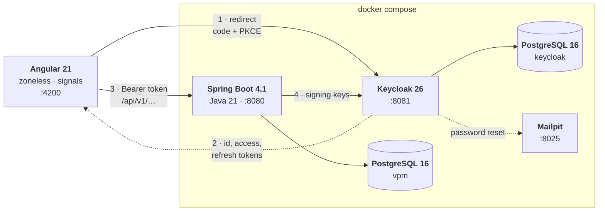

# Visual Project Manager

A planning tool for work that has an order to it. Tasks carry dates,
people and dependencies; the chart draws them; and the part worth building
is the one a list of tasks cannot show you — which of these tasks, if it
slips by a day, moves the finish date by a day.

Angular 21 in front, Spring Boot 4.1 behind, Keycloak for identity,
PostgreSQL underneath, and one `docker compose up` to run all of it.


---

## Contents

- [What it does](#what-it-does)
- [Running it](#running-it)
- [Architecture](#architecture)
- [Decisions worth explaining](#decisions-worth-explaining)
- [The API](#the-api)
- [Tests](#tests)
- [Repository layout](#repository-layout)
- [Security](#security)
- [What it does not do](#what-it-does-not-do)

---

## What it does

### The schedule

Every task in the project, with its dates, its status, its priority, the
person doing it and what it is waiting on. Filter by status, by priority
or to a window of dates; sort by start, end, title, priority or status.

Both happen in the browser, over the whole plan rather than over what is
on screen — the list is already in memory and already the source both
views read from, so asking the server would add a round trip, a loading
state and a second definition of what "matching" means.

The date window selects tasks that **overlap** it rather than tasks
contained by it. A task running from before the window to after it is the
most relevant thing in that period, and a containment test is the one
thing that would exclude it.


### The chart

The same plan, drawn. Bars can be dragged to move a task and grabbed at
either end to resize it — optimistically, so the bar follows the pointer
and rolls back if the server refuses. Arrows connect each task to what it
waits for. Tasks with zero float are marked: those are the ones that
decide the launch date.

The table beside the chart can be widened or narrowed with the divider,
and sheds columns as it gets smaller — dates go first, because the bar
next to them is drawn from exactly those two numbers.

### Editing a task

Dates, status, priority, colour, assignee and dependencies in one panel.
Dependencies are checked as they are added: a task cannot depend on
itself, cannot close a cycle, and cannot be marked done while something it
waits on is unfinished. Each refusal names the task responsible rather
than saying no.


### People and roles

Owners, editors and viewers, per project rather than globally — the same
person can own one plan and only read another. Invitations go by email and
work for people who have never signed in: a placeholder is created and
claimed the first time they do.


### History

Who changed what, and when. Written by the code making each change rather
than by a listener or an aspect, which is why it can say a task *moved
from the 3rd to the 21st* instead of that a task was updated.


### Signing in

Keycloak, with a login theme that matches the application rather than
announcing that a different product is handling the password. Registration
and password reset are both live; reset messages land in Mailpit, a fake
mail server in the compose file, so the whole flow can be followed through
on a laptop with no mail account anywhere.


---

## Running it

You need Docker and about four gigabytes of RAM. Nothing else — Java, Node
and Maven are only needed to develop, not to run.

```bash
git clone https://github.com/ghiacciolodev/Visual-Project-Manager.git
cd Visual-Project-Manager
cp .env.example .env          # on Windows: copy .env.example .env
docker compose up -d
```

First start takes a couple of minutes: Keycloak imports its realm, Flyway
creates the schema, and both images are built. When it settles:

| | |
|---|---|
| Application | http://localhost:4200 |
| API | http://localhost:8080/api/v1 |
| Keycloak | http://localhost:8081 |
| Mailpit (the fake inbox) | http://localhost:8025 |

Register an account from the sign-in screen and you get an empty schedule
to fill.

### Or start from the demo project

The screenshots above are a real plan in a real database. To have it:

```bash
pwsh scripts/demo/seed.ps1
```

It creates four accounts in Keycloak and a thirteen-week storefront
relaunch in the application database, linked to each other. Sign in as any
of them, password `demo`:

| | | |
|---|---|---|
| `harriet` | Harriet Vance | owner |
| `marcus` | Marcus Bell | editor |
| `priya` | Priya Raghavan | editor |
| `tom` | Tom Iversen | viewer |

They all see the same plan. What differs is what the interface lets them
do with it — sign in as Tom to see the read-only view, and as Harriet to
see the members panel that Marcus and Priya are not offered.

Run it twice and the second run replaces the first. It writes only its own
project and its own four `@northwind.example` accounts, so a database you
are already using keeps everything else. It is for local development only,
and [SECURITY.md](SECURITY.md) says why.

### Developing

The two applications run better outside the containers, against the
infrastructure inside them:

```bash
docker compose up -d db keycloak keycloak-db mailpit
```

```bash
cd backend && ./mvnw spring-boot:run
```

```bash
cd frontend && npm install && npm start
```

The frontend must be served on port 4200. That is the only redirect URI
the Keycloak client accepts, and the only origin the backend's CORS
configuration allows.

---

## Architecture



**Two databases, not one.** An identity provider's schema is its own
business: sharing one would mean a Flyway migration and a Keycloak upgrade
can collide over the same tables.

**Keycloak is addressed by two URLs and that is deliberate.** The browser
reaches it at `localhost:8081`, so that is the issuer written into every
token. The backend, inside the compose network, cannot resolve that
address — `localhost` is its own loopback — and fetches signing keys at
`keycloak:8080` instead. So the keys come over the internal address while
the issuer claim is checked against the public one. Using the internal
address for both would reject every real token; skipping the issuer check
would accept tokens minted by any realm on that server.

**Identity is federated; authorisation is local.** Keycloak knows who you
are and has no idea which projects you belong to. Roles are rows in this
application's database, checked per request. [SECURITY.md](SECURITY.md)
explains why they are not in the token.

### Inside the backend

Packages are by feature, not by layer — `task/`, `project/`, `schedule/`,
`audit/`, `user/`, each with its controller, service, entity and DTOs
together. Opening `task/` shows everything tasks do.

```
Controller ──▶ Service ──▶ Repository ──▶ PostgreSQL
                  │
             @PreAuthorize("@access.canEdit(#projectId)")
```

Authorisation sits on the **service**, one layer closer to the data than
the controller, so it still applies if a second controller, a scheduled
job or a test calls in.

Flyway owns the schema and Hibernate is set to `validate`. With `update`,
Hibernate silently alters the database and the migrations stop being the
truth.

### Inside the frontend

Standalone components, `OnPush`, zoneless change detection, signals rather
than observables in the view layer. Services hold state as signals;
components read them and compute.

The three panels — members, project, history — are `@defer`red, so most
people never download them. A production build's initial bundle is 413 kB
raw, 105 kB over the wire.

Geometry is a set of pure functions in `core/schedule.ts` — where a bar
starts, how wide it is, where a connector's elbow goes, what dates a drag
of *n* pixels means. Deliberately separated from the components, because a
function can be tested by calling it and an event handler can only be
tested by mounting a component and pretending to be a mouse.

---

## Decisions worth explaining

### The critical path is the point of the whole thing

`CriticalPathService` runs the Critical Path Method: two passes over the
dependency graph in topological order (Kahn's algorithm), forward for the
earliest each task can start and backward for the latest it can start
without moving the finish date. The difference is that task's total float,
and the tasks with none of it are the critical path.

It is arithmetic on in-memory maps rather than queries, because the graph
is small enough that fetching it once and walking it in Java beats asking
the database per step — which is the opposite of the trade-off made for
cycle detection, where a recursive CTE answers "is this reachable from
that?" in one round trip and Java would need the whole graph to answer the
same question.

### Two people editing one task

Send back the `updatedAt` the form was built from, and the server refuses
the write if the task has moved on:

```java
if (!request.expectedUpdatedAt().equals(task.getUpdatedAt())) {
    throw new ConflictException("Somebody else changed this task while you were editing it…");
}
```

Compared by **equality**, not by "is older". A clock that steps backwards
or two instances a few milliseconds apart would make an ordering test
quietly accept a stale write. The question is not "is this newer" but "is
this the same task I read".

Not `If-Unmodified-Since`, which would be the obvious HTTP answer: that
header carries whole seconds, and two edits inside the same second are
exactly the case being defended against.

### Other people's changes arrive on their own

The task list is re-fetched every twenty seconds while a view is open, so
somebody else's new task appears without a reload. Polling, not WebSockets
or SSE — with an honest reason: this is a planning tool where a change
lands every few minutes at most, a twenty-second delay is invisible at that
tempo, and a push channel means a connection to hold open, a reconnection
policy, and per-project fan-out for a payload that is a few kilobytes of
JSON. The polling is reference-counted, pauses while the tab is hidden and
while a bar is being dragged, and would be the thing to replace first if
this ever became collaborative in the live-cursor sense.

### One component behind two routes

The schedule and the chart were separate components drawing the same dates
two different ways. They share one component now; what the two routes
carry is whether the timeline is drawn beside the table.

For a while both drew it, on the argument that one screen answering
questions about dates and people at the same time beats two answering half
each. On a wide monitor that held. On a laptop the table's own columns left
the timeline about ten days wide, and a sliver of chart reads as a mistake
rather than as a choice — so the schedule is a table and the chart is a
chart, and the code they have in common is still in one place.

### Pagination that the default caller never sees

`GET /tasks` returns everything unless asked otherwise. `?page=&size=`
switches to pages, reported in `X-Total-Count` / `X-Page` /
`X-Page-Size` headers rather than by wrapping the body.

The response shape never changes, so a caller that does not ask for pages
cannot be broken by their arrival — and this application is such a caller,
deliberately. The chart measures its window from the earliest start to the
latest end across the whole plan and the filters are computed over the same
list; hand either of them one page and the chart draws the wrong scale
while the filters silently narrow one fiftieth of the data.

### Tasks are soft-deleted

`deleted_at` is set and the row stays. It keeps dependency references
intact and keeps the history readable after the thing it describes is
gone. It is also a data-retention question with no answer yet, which
[SECURITY.md](SECURITY.md) lists rather than hides.

---

## The API

`/api/v1`, JSON, Bearer tokens. Errors are RFC 9457 Problem Details.

| Method | Path | |
|---|---|---|
| `GET` | `/projects` | the caller's projects |
| `POST` | `/projects` | create, as owner |
| `GET` `PUT` `DELETE` | `/projects/{id}` | read, rename, delete |
| `GET` | `/projects/{id}/members` | |
| `POST` | `/projects/{id}/members` | invite by email |
| `PATCH` | `/projects/{id}/members/{userId}` | change role |
| `DELETE` | `/projects/{id}/members/{userId}` | remove, or leave |
| `GET` | `/projects/{id}/tasks` | all, or `?page=&size=` |
| `POST` | `/projects/{id}/tasks` | 201 with `Location` |
| `GET` `PUT` `DELETE` | `/projects/{id}/tasks/{taskId}` | |
| `POST` | `/projects/{id}/tasks/{taskId}/dependencies` | |
| `DELETE` | `/projects/{id}/tasks/{taskId}/dependencies/{predecessorId}` | |
| `GET` | `/projects/{id}/schedule/critical-path` | float per task, and the path |
| `GET` | `/projects/{id}/audit` | history, newest first |
| `GET` | `/me` | the caller, provisioned on first sight |

Writes are rate limited to 120 a minute per caller and answer `429` with
`Retry-After`. Reads are not limited — [SECURITY.md](SECURITY.md#csrf-cors-rate-limiting)
explains the asymmetry.

---

## Tests

```bash
cd backend  && ./mvnw verify      # 51 tests
cd frontend && npm test           # 84 tests, 9 files
```

**Backend.** Unit tests for the parts with logic worth testing on their
own — the critical path, cycle detection, validation — and integration
tests that run the whole stack against a real PostgreSQL started by
Testcontainers. One database per run, torn down with it, no second place
where the version has to be kept in step. The integration tests are bound
to `verify` through Failsafe; they are the ones that prove authorisation
actually refuses, which a mocked repository cannot.

**Frontend.** Vitest through Angular's own test builder. The pure geometry
functions are tested by calling them; the services against
`HttpTestingController`; polling against fake timers; and the component
by constructing it and asking what it computed, rather than by rendering
it and reading the DOM back.

Some of them exist because something was wrong. `select-binding.spec.ts`
pins the reason a member added as `EDITOR` displayed as `OWNER`: `[value]`
on a `<select>` is assigned before `@for` has created any options, so the
browser falls back to the first one.

CI runs both on every push and pull request.

---

## Repository layout

```
backend/          Spring Boot 4.1, Java 21
  src/main/java/it/ghiacciolodev/vpm/
    task/         tasks, dependencies, the graph
    project/      projects, membership, the authorisation rules
    schedule/     critical path
    audit/        history
    user/         local accounts, provisioned from the token
    security/     JWT decoding, role conversion, filter chain
    common/       Problem Details, validation, rate limiting
  src/main/resources/db/migration/    Flyway
  src/test/                           unit + Testcontainers

frontend/         Angular 21, standalone, zoneless
  src/app/
    core/         services, pure geometry, guards, interceptor
    features/     gantt · tasks · members · projects · history
    models/

keycloak/
  realm-export.json     the whole identity setup, version controlled
  themes/vpm/           the login theme

scripts/demo/     the plan in the screenshots
docker-compose.yml
```

---

## Security

Identity, authorisation, input handling and — at more length — the things
that are wrong with all three: **[SECURITY.md](SECURITY.md)**.

The short version: Authorization Code with PKCE and no client secret;
authorisation enforced on the service layer per project; `404` rather than
`403` for non-members so ids cannot be enumerated; every task lookup keyed
by id *and* project; validation both in the DTO and as CHECK constraints
in the schema. And the one that matters most: tokens live in
`sessionStorage`, which any successful XSS can read.

---

## What it does not do

There is no live collaboration — no cursors, no presence, no operational
transform. Two people editing the same task get a conflict, not a merge.

There is no export. No PDF, no CSV, no iCal, no Microsoft Project file.

There is no capacity model. A person can be assigned three tasks that
overlap completely and nothing objects, because the schedule knows dates
and dependencies and nothing about how long anybody's day is.

There is no baseline. You cannot compare the plan to what it looked like
last month; the history says what changed, but the chart only ever draws
now.

Rows are not virtualised. The plan renders every task, which is fine into
the hundreds and would need `cdk-virtual-scroll` beyond that. Measured
before deciding rather than assumed: from fifty rows to a thousand, the
cost of editing one of them stays flat at about 4 ms, because signals
update the row that changed and not the list. That is why the dependency
is not there.
